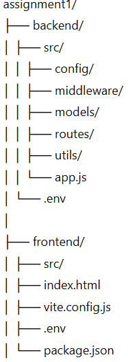
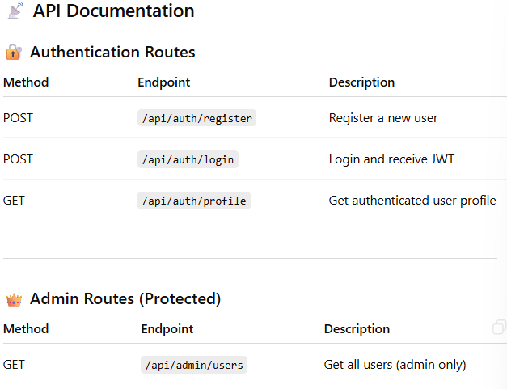
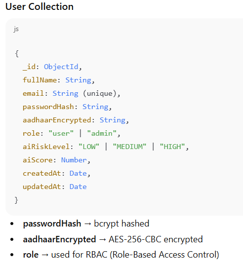
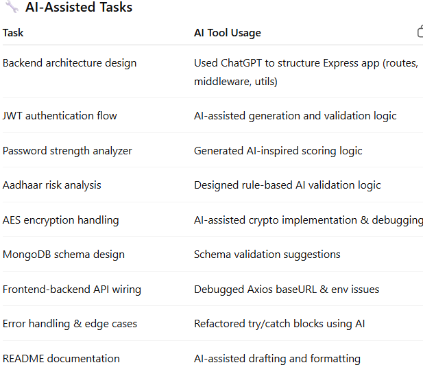

# 🔐 Secure Digital Identity Vault  
*A Full-Stack Identity Management System with AI-Assisted Validation*

---

## 📌 Project Overview

**Secure Digital Identity Vault** is a full-stack web application designed to securely manage user identities and profiles with a strong focus on **security, validation, and role-based access control**.

The system enables users to register and authenticate using JWT-based authentication, securely stores sensitive identity information (Aadhaar number) using AES encryption, and leverages **AI-inspired validation logic** to assess the risk level of identity data and password strength.

An **Admin Dashboard** is included to demonstrate role-based authorization, allowing administrators to view system users while restricting access for regular users.

### 🛠️ Implementation Approach
- **Backend** built with Node.js, Express, MongoDB (Mongoose)
- **Frontend** built with React (Vite) and Axios
- **Security-first design** using encryption, hashing, JWTs
- **AI-assisted validation** for Aadhaar numbers and password strength
- **Clear separation of concerns** (routes, middleware, utils, models)

---

## ⚙️ Setup & Run Instructions

### ✅ Prerequisites
- Node.js (v18+ recommended)
- npm
- MongoDB Atlas account (or local MongoDB)

---

### 📂 Project Structure

---

### 🚀 Backend Setup

cd backend
npm install

Run backend =node src/app.js

###  env Backend

# MongoDB connection string (replace <username>, <password>, and <cluster-url>)
MONGO_URI=mongodb+srv://<username>:<password>@<cluster-url>/<database>?retryWrites=true&w=majority

# Database name
DB_NAME=identity_vault

# JWT secret key (use a strong random string in production)
JWT_SECRET=<your_jwt_secret>

# AES encryption key (must be 64 hex characters for 256-bit key)
AES_KEY=<your_64_char_hex_key>

# AES initialization vector (must be 32 hex characters for 128-bit IV)
AES_IV=<your_32_char_hex_iv>

###  env frontend
VITE_API_BASE_URL=http://localhost:5000/api

###   frontend run 
  front end run = npm run dev

📊 Effectiveness Score

Score: 5 / 5

Justification:
AI tools significantly accelerated development by reducing boilerplate code time, assisting in debugging complex issues (MongoDB auth, AES encryption, env configuration), and improving documentation quality. While human oversight was required during debugging, overall productivity increased substantially, saving an estimated 6–8 hours.

📈 Evaluation Criteria Alignment
✅ Backend Implementation (High)

RESTful API design

JWT authentication

AES encryption for sensitive data

Robust validation & error handling

MongoDB integration with Mongoose

✅ Frontend Implementation (High)

Clean, responsive UI

Secure token handling

Role-based UI rendering

Correct API communication via Axios

✅ Code Quality (High)

Modular structure

Clear naming conventions

Separation of concerns

Defensive programming

✅ Documentation & Submission (Medium)

Clear setup instructions

Detailed API documentation

Complete AI Tool Usage Log

✅ AI Tool Utilization (High)

Strategic use of AI for productivity, debugging, and documentation

🏁 Conclusion

This project demonstrates a secure, scalable, and industry-aligned identity management system, integrating modern backend security practices, frontend best practices, and responsible AI-assisted development.

